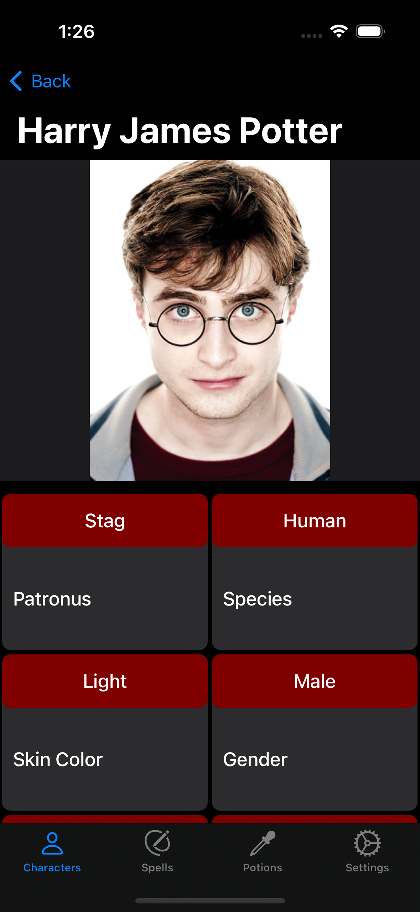

# Harry Potter iOS App

Welcome to the Harry Potter iOS App repository! This app showcases a comprehensive list of characters, spells, and potions from the magical world of Harry Potter. Built with an emphasis on clean architecture and user experience, it's a testament to modern iOS development practices.

## Features

- **Characters, Spells, and Potions**: Browse through extensive lists presented in a collection view with smooth pagination.
  - **Detailed View**: Click on any cell to get an in-depth look at characters, spells, or potions.
  - **Search**: Currently, you can search for your favorite characters. Stay tuned for the ability to search spells and potions!
- **Settings Tab**: Contains credits for the icons used and the Harry Potter API.
- **Animated Splash Screen**: A delightful introduction to the magical world.
- **Coming Soon**: Search functionality for spells and potions.

## Technical Details

- **Architecture**: The app is built using the MVVM (Model-View-ViewModel) design pattern.
- **UI**: All user interfaces are programmatically implemented, ensuring precision and flexibility.
- **Language**: The entire codebase is in Swift, showcasing best practices and modern syntax.

## Credits

- **API**: The data is sourced from [PotterDB](https://docs.potterdb.com/).
- **Icon**: The app icon is courtesy of [Flaticon](https://www.flaticon.com/free-icons/harry-potter).
- **CocoaPods**: The app uses the `SwiftGifOrigin` pod for specific functionalities.

## For Recruiters/Managers

This project is a testament to my skills and expertise in iOS development. I've ensured that the code is clean, scalable, and maintainable. I'm confident that this project will give you a comprehensive understanding of my capabilities as an iOS developer. If you have any questions or would like to discuss further opportunities, please feel free to reach out.

## Getting Started

If you wish to run the project locally:

1. Clone the repository.
2. Ensure you have CocoaPods installed. If not, you can install it using `sudo gem install cocoapods`.
3. Navigate to the project directory and run `pod install` to install the necessary dependencies.
4. Open the `.xcworkspace` file in Xcode.
5. Build and run the project on your preferred simulator or device.

## Feedback and Contributions

I'm always open to feedback, suggestions, and contributions. If you find any bugs or areas of improvement, please open an issue or send a pull request.

---

Thank you for taking the time to explore this project. I look forward to any opportunities to collaborate or discuss my work further.
